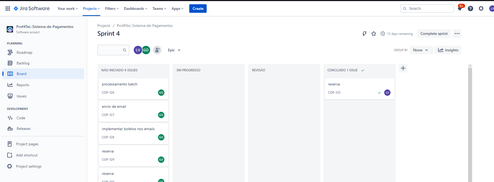

# IHC - Interação Humano Computador - Heurísticas de Nielsen
### Nome: Lucas Vinicius da Silva Soares
### Semestre: 3º Desenvolvimento de Software Multiplataforma

### As diretrizes de design estabelecidas por Jakob Nielsen, um especialista em usabilidade amplamente reconhecido, são conhecidas como as 10 heurísticas de usabilidade de Nielsen. Essas heurísticas são utilizadas na área de experiência do usuário (UX) para avaliar e aprimorar a usabilidade de produtos e interfaces. Abaixo estão listadas as 10 heurísticas de Nielsen:

 

1. **Visibilidade do status do sistema:**  Para garantir a satisfação do usuário, o sistema deve fornecer informações claras e em tempo real sobre o que está acontecendo. Isso inclui feedback adequado sobre o progresso, tempo de carregamento e status das tarefas concluídas. É importante que os usuários estejam sempre cientes do estado atual do sistema. /

2. **Correspondência entre o sistema e o mundo real:** Para garantir a compreensão e facilidade de uso, o sistema deve utilizar linguagem e conceitos familiares ao usuário, seguindo convenções do mundo real. As informações apresentadas devem ser organizadas de forma lógica e intuitiva, levando em consideração o conhecimento prévio do usuário. É essencial estabelecer uma conexão natural entre o sistema e a experiência do usuário.

3. **Controle e liberdade do usuário:** É essencial que os usuários tenham o controle sobre suas ações e a liberdade de desfazer ações indesejadas ou explorar diferentes opções sem enfrentar consequências graves. Para garantir isso, é importante fornecer mecanismos como botões "voltar" e "cancelar", bem como opções claras para sair de situações indesejadas. Dessa forma, os usuários se sentirão mais confiantes e no comando durante sua interação com o sistem

4. **Consistência e padrões:** Elementos de interface, como botões, ícones e menus, devem ser consistentes em todo o sistema. Os padrões de design devem seguir convenções amplamente aceitas para que os usuários possam entender e prever o comportamento do sistema.

5. **Prevenção de erros:** O sistema deve ser projetado para prevenir erros sempre que possível. Isso pode ser alcançado por meio de avisos claros, confirmações de ações perigosas e restrições em recursos que possam levar a erros.

6. **Reconhecimento ao invés de memorização:** É mais eficiente e amigável aos usuários que eles possam reconhecer elementos e opções em vez de terem que memorizar informações específicas. Os comandos e recursos devem ser claramente visíveis e facilmente acessíveis, reduzindo a carga cognitiva exigida. Ao minimizar a necessidade de lembrar informações, os usuários podem se concentrar melhor na conclusão de suas tarefas e na interação com o sistema.

7. **Flexibilidade e eficiência de uso:** O sistema deve atender às necessidades de diferentes usuários, permitindo tanto para iniciantes quanto para usuários experientes. É importante oferecer atalhos de teclado, opções personalizáveis ​​e métodos rápidos de execução de tarefas.

8. **Estética e design minimalista:** O design da interface deve ser limpo, esteticamente agradável e livre de informações desnecessárias. Elementos visuais devem ser utilizados para direcionar a atenção do usuário para as informações e ações mais importantes.

9. **Ajuda e documentação:** Quando necessário, é importante que exista um suporte claro e acessível para ajudar os usuários a entenderem o sistema. Isso pode incluir documentação de ajuda, tutoriais, dicas de contexto e mensagens de erro explicativas. Disponibilizar esses recursos pode ajudar os usuários a superar problemas e entender melhor como utilizar o sistema.

10. **Reconhecimento de erros:** Quando ocorrerem erros, o sistema deve fornecer mensagens de erro claras e significativas, indicando o problema de maneira não técnica e sugerindo soluções construtivas para corrigir o erro.

# Exemplos de aplicação das heurísticas de Nielsen
| ID Eurística | Imagem | Descrição |
|--|--|--|
| 9 |  | A documentação do Java é uma interface essencial que auxilia os usuários a compreender o sistema de forma clara e eficiente, a documentação é bem organizada, mostrando exatamente o que deve ser feito antes de fazer qualquer coisa |
| 8 |  | A interface da página inicial do website do YouTube pode ser considerada como um excelente exemplo de design agradável. O sistema apresenta uma interface minimalista e bem organizada, com uma quantidade adequada de textos e imagens, que são claros, objetivos e fáceis de entender. |
| 8 |  | A interface da página inicial do website do Aliexpress pode ser considerada como um exemplo de design pouco intuitivo. Ao abrir o aplicativo, os usuários podem se sentir sobrecarregados devido à grande quantidade de textos e imagens, o que pode causar certa confusão e dificuldade em navegar. |
| 1 |  | A interface de download da Steam é um excelente exemplo de como manter os usuários bem informados durante o processo. Na imagem fornecida como exemplo, é possível visualizar claramente a velocidade atual do download em MB/s, além de receber atualizações constantes sobre o progresso do download e o tempo estimado restante para a conclusão. Essa abordagem mantém o usuário engajado e ciente do status do download de forma clara e eficaz.|
| 2 |  |O navegador Opera é um exemplo de sistema que utiliza uma abordagem amigável e compreensível para o usuário. Na situação em que o usuário acessa um site inexistente, em vez de exibir uma mensagem técnica de erro, como "404 Not Found", o navegador adota uma linguagem mais simples e intuitiva, como "Não é possível acessar esse site". Essa escolha de palavras facilita a compreensão do usuário e evita confusões desnecessárias. |
| 3 |  | No aplicativo de galeria de qualquer smartphone, quando você tenta excluir uma imagem ou vídeo, é comum aparecer um botão de cancelar para evitar exclusões acidentais caso você tenha pressionado o botão incorretamente. Essa opção permite que você desfaça a ação indesejada e evita possíveis arrependimentos. |
| 4 |  | O sistema do Jira exemplifica de forma positiva a consistência e o uso de padrões. Ele adota elementos de interface, como botões, ícones e menus, que se mantêm consistentes em todas as áreas do sistema. Além disso o Jira consegue permitir que os usuários compreendam e prevejam o comportamento do sistema de forma intuitiva. Essa abordagem contribui para uma experiência de uso mais fluida e eficiente. |
| 5 |  | O sistema operacional Windows demonstra um bom exemplo de proteção contra erros. No exemplo da imagem, quando alguém tenta excluir um arquivo importante para o funcionamento do sistema, o sistema exibe uma mensagem de aviso, alertando o usuário para evitar a exclusão acidental do arquivo. Essa medida de precaução ajuda a prevenir erros grave. |
| 7 |  | O sistema do Spotify é um ótimo exemplo de flexibilidade e eficiência de uso. O sistema consegue atender às necessidades de diversos tipos de usuários, oferecendo opções e métodos rápidos de execução de tarefas, tanto para iniciantes quanto para usuários experientes. Isso significa que o Spotify é acessível e intuitivo, permitindo que os usuários aproveitem a plataforma de forma conveniente, independentemente do seu nível de experiência. |
| 6 |  | O sistema de reprodução de vídeo do YouTube é um excelente exemplo de reconhecimento ao invés de memorização. Ele utiliza elementos visuais efetivamente para direcionar a atenção do usuário para as informações e ações mais relevantes. Na imagem fornecida como exemplo, o sistema apresenta ícones claros para pausar, aumentar o volume e pular para o próximo vídeo, tornando o entendimento fácil para qualquer usuário. Essa abordagem permite que os usuários reconheçam e utilizem essas funcionalidades sem a necessidade de memorizar instruções complexas. |